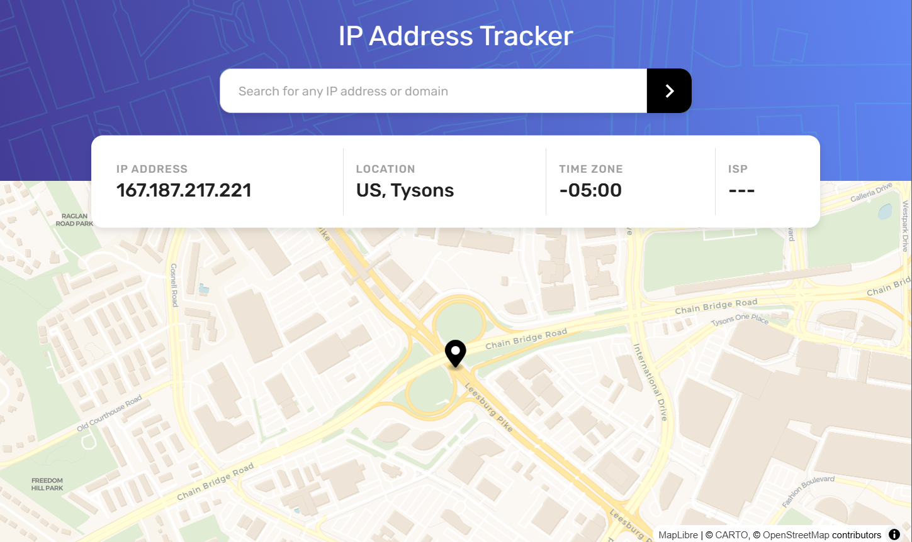

# 🌍 IP Address Tracker

A web application that allows users to track the geographical location of any IP address in real-time.  
It provides detailed information such as city, country, timezone, and ISP, along with an interactive map visualization.

🔗 **Live Demo:** [IP Founder](https://ip-founder.netlify.app)

## ▶️ Preview

## 🚀 Features

### 📌 IP Tracking

- 🔍 **Search any IP address** and get real-time location data
- 🌎 **Automatically detects user's own IP address** on page load

### 📊 Detailed Information

- 🏩 **City & Country**
- 🕒 **Timezone**
- 🏢 **Internet Service Provider (ISP)**

### 🗺 Interactive Map

- 🏞 **Displays IP location on an interactive map** using **MapLibre**
- 🔄 **Supports zoom and pan for better exploration**

### 💎 User Experience

- ✅ **Fully responsive** design for mobile & desktop
- ⚡ **Fast and efficient performance** using **React Query**
- ❌ **Error handling** for invalid or unreachable IP addresses
- 🎨 **Modern UI built with MUI (Material-UI)**

## 🪛 Technologies Used

- ⚛️ **React** : A JavaScript library for building dynamic and complex user interfaces.
- 📦 **Next.js** : A React framework for building fast, scalable web applications with features like SSR (Server-Side Rendering) and Static Site Generation.
- 🎨 **MUI (Material UI)** : A collection of React components based on Material Design principles for creating modern and customizable UI.
- 🔍 **React-Query** : A library for managing HTTP requests and data caching with high performance.
- 📋 **React-Hook-Form** : A library for managing forms in React with minimal boilerplate and high performance.
- 🗺️ **MapLibre** : A mapping library for creating interactive, customizable maps in web applications.

### 🎉 Enjoy using it!
